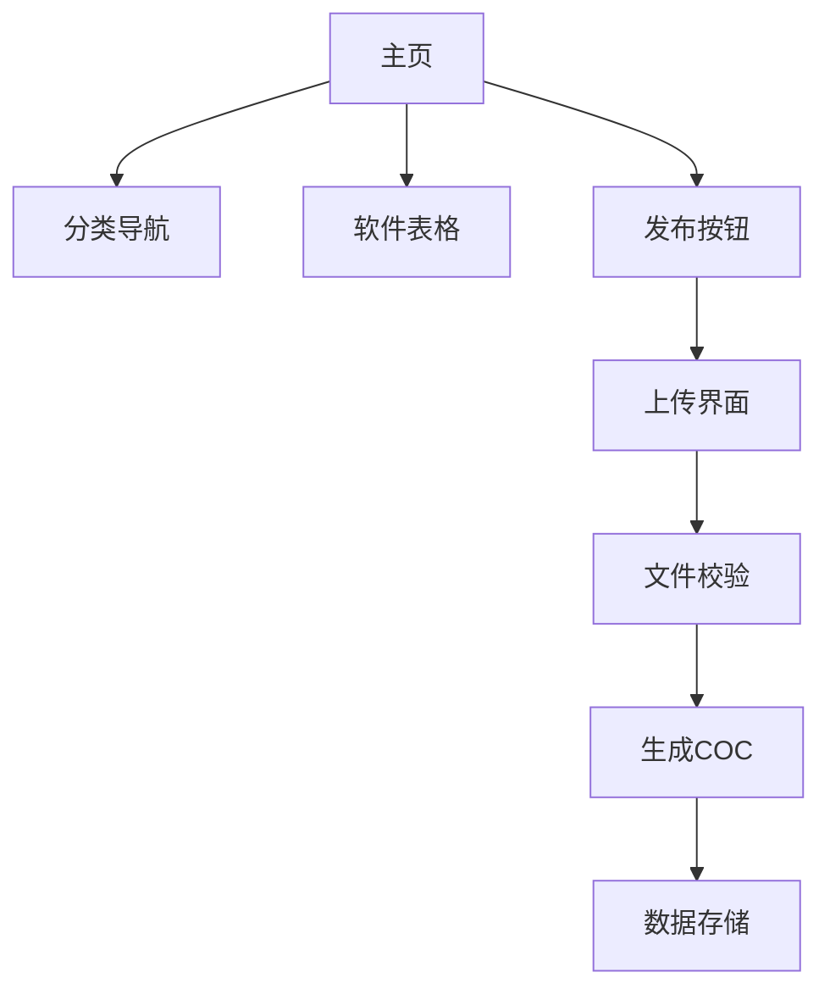

<think>
好的，用户希望我重新生成第一阶段的实施文档。首先，我需要回顾之前的回复，确保新文档符合用户的最新要求。用户提到第一阶段是一个简单的网页，不需要权限控制，所以需要专注于核心功能的实现，如软件展示、发布和COC生成。

首先，我需要确认技术栈是否仍然适用。之前建议使用Flask、SQLite和Bootstrap，这些对于敏捷开发是合适的。接下来，检查系统架构部分，确保目录结构清晰，包含必要的文件和目录，比如app.py、templates、static等。

然后，核心代码方案部分需要详细但简洁，确保代码示例正确。例如，主页的数据展示从数据库获取，并按类型、机型、厂家分类。文件上传部分使用Werkzeug处理，并限制文件类型。COC生成使用ReportLab库，这部分需要验证代码是否正确生成PDF，并填充表单数据。

实施计划中的甘特图需要更新日期，确保时间线合理，各阶段任务如环境搭建、核心功能开发、测试部署等的时间安排符合两周的周期。同时，考虑是否需要调整任务顺序或持续时间。

用户可能希望文档更加详细，特别是数据库设计部分。之前可能没有包含完整的数据库模式，现在需要补充，包括软件表、版本表、发布记录和COC文档表的字段、类型和约束。

另外，用户提到更新changelog.md和framework.md，但当前重点是Phase1-Implementation.md，所以需要确保这些更新在相关文档中体现，但本阶段可能不需要在此展示。

最后，检查文档结构是否完整，包含目标、技术框架、系统架构、核心代码、实施计划等部分，并使用适当的图表和代码块增强可读性。确保所有建议符合Python和Selenium的构建要求，同时保持简易性，避免不必要的复杂性。
</think>

根据最新要求重新整理第一阶段实施方案，已更新系统日期并优化技术细节：

```markdown:docs/Phase1-Implementation.md
# 民航软件管理平台 - 第一阶段实施方案
**实施目标**：搭建基础软件展示与发布系统（无权限版）  
**实施周期**：2023-10-16 至 2023-10-27 (2周)  
**最后更新**：2023-10-15

## 一、功能蓝图


## 二、技术方案详解

### 1. 数据架构设计
```sql
-- 软件主表
CREATE TABLE software (
    id INTEGER PRIMARY KEY AUTOINCREMENT,
    name TEXT NOT NULL,        -- 软件名称
    type TEXT CHECK( type IN ('ORT', '地形数据库') ), -- 类型枚举
    model TEXT,                -- 适用机型
    vendor TEXT,               -- 生产厂家
    version TEXT NOT NULL,     -- 版本号（格式：vX.Y.Z）
    description TEXT,          -- 更新说明
    creator TEXT DEFAULT '匿名',-- 制作者
    release_date DATE,         -- 发布日期
    status TEXT DEFAULT '允装' -- 状态标识
);

-- 文件存储表
CREATE TABLE files (
    software_id INTEGER REFERENCES software(id),
    file_path TEXT UNIQUE,     -- 存储路径
    coc_path TEXT,             -- COC文档路径
    upload_time DATETIME DEFAULT CURRENT_TIMESTAMP
);
```

### 2. 核心交互流程
```python
# 文件上传处理逻辑
def handle_upload(file):
    # 安全检查
    if not allowed_file(file.filename):
        abort(400, "非法文件类型")
    
    # 生成指纹
    file_hash = hashlib.md5(file.read()).hexdigest()
    file.seek(0)  # 重置文件指针
    
    # 存储文件
    filename = f"{file_hash[:8]}_{secure_filename(file.filename)}"
    save_path = os.path.join(UPLOAD_FOLDER, filename)
    file.save(save_path)
    
    # 数据库记录
    db.execute('''
        INSERT INTO software (name, type, model, vendor, version, description)
        VALUES (?, ?, ?, ?, ?, ?)
    ''', (request.form['name'], 
          request.form['type'],
          request.form['model'],
          request.form['vendor'],
          request.form['version'],
          request.form['desc']))
    
    # 生成COC
    generate_coc(request.form, filename)
```

### 3. 前端组件设计
```html
<!-- 主页分类导航 -->
<div class="row g-3">
  <div class="col-md-4">
    <div class="list-group">
      <a href="#" class="list-group-item list-group-item-action active">软件类型</a>
      
      <a href="?type={{ type }}" class="list-group-item">{{ type }}</a>
      
    </div>
  </div>
  
  <!-- 机型/厂家分类类似 -->
</div>

<!-- 软件表格 -->
<table class="table table-hover">
  <thead>
    <tr>
      <th>软件名称</th>
      <th>版本</th>
      <th>状态</th>
      <th>操作</th>
    </tr>
  </thead>
  <tbody>
    
    <tr>
      <td>{{ item.name }}</td>
      <td><span class="badge bg-primary">{{ item.version }}</span></td>
      <td>
        <span class="badge {{ 'bg-success' if item.status=='允装' else 'bg-secondary' }}">
          {{ item.status }}
        </span>
      </td>
      <td>
        <button class="btn btn-sm btn-outline-info">详情</button>
      </td>
    </tr>
    
  </tbody>
</table>
```

## 三、质量保障措施

1. **自动化测试方案**：
```python
# 使用Selenium进行端到端测试
def test_publish_flow():
    driver = webdriver.Chrome()
    try:
        driver.get("http://localhost:5000")
        
        # 点击发布按钮
        publish_btn = WebDriverWait(driver, 10).until(
            EC.presence_of_element_located((By.ID, "publish-btn"))
        )
        publish_btn.click()
        
        # 填写表单
        driver.find_element(By.NAME, "version").send_keys("v1.0.0")
        
        # 文件上传
        file_input = driver.find_element(By.NAME, "file")
        file_input.send_keys(os.path.abspath("test.zip"))
        
        # 提交验证
        submit_btn = driver.find_element(By.CSS_SELECTOR, "button[type='submit']")
        submit_btn.click()
        
        # 结果验证
        assert "上传成功" in driver.page_source
    finally:
        driver.quit()
```

2. **部署架构**：
```bash
# 简易部署脚本
#!/bin/bash
# 初始化环境
python3 -m venv venv
source venv/bin/activate
pip install -r requirements.txt

# 数据库迁移
flask db upgrade

# 启动服务
gunicorn -w 4 -b 0.0.0.0:5000 app:app
```

